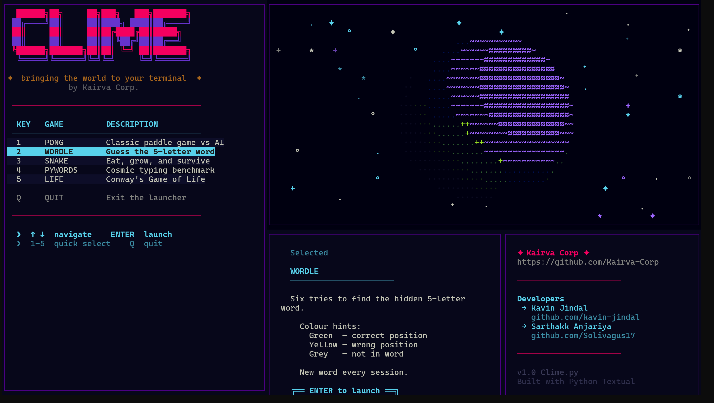
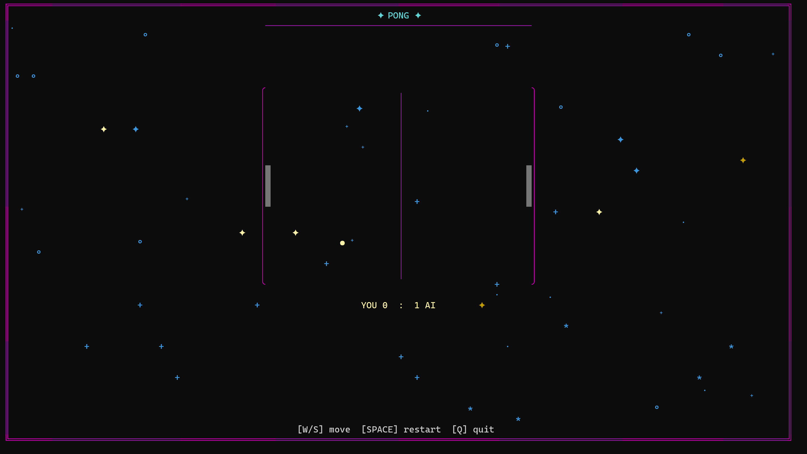

# CLIME — Cosmic Game Launcher

```text
  ██████╗██╗     ██╗███╗   ███╗███████╗
 ██╔════╝██║     ██║████╗ ████║██╔════╝
 ██║     ██║     ██║██╔████╔██║█████╗  
 ██║     ██║     ██║██║╚██╔╝██║██╔══╝  
 ╚██████╗███████╗██║██║ ╚═╝ ██║███████╗
  ╚═════╝╚══════╝╚═╝╚═╝     ╚═╝╚══════╝
```

> **✦ Bringing the world to your terminal ✦**
> *Developed by Kairva Corp.*

---

**CLIME** is a premium, terminal-based game launcher designed with a stunning cosmic aesthetic. Built using **Python**, **Textual**, and **Rich**, it provides a unified and immersive experience for classic terminal games, all wrapped in a sleek "bento-grid" interface with animated starfields, pulsing borders, and floating fireflies.

## Features

- **Cosmic UI**: Twinkling backgrounds, animated starfields, and glowing accents in every game.
- **Seamless Launcher**: Quick-select menu with instant launch and automatic module reloading.
- **Animated Earth**: A live-rotating ASCII Earth widget in the main dashboard.
- **Unified Aesthetic**: All games follow the same "Cosmic Dark" design language for a consistent feel.

## Screenshots

<div align="center">





</div>

## Included Games

1.  **PONG**: Classic paddle simulation with a smart AI and physics-based circular ball rendering.
2.  **WORDLE**: The viral word-guessing game with high-contrast cosmic feedback.
3.  **SNAKE**: Eat, grow, and survive in deep space with vibrant multi-segment rendering.
4.  **PYWORDS**: A high-speed typing benchmark featuring static ASCII cat decorations.
5.  **LIFE**: A full-window Conway's Game of Life simulation with low-clutter visualization.

## Installation

### 1. Prerequisites
Ensure you have **Python 3.8+** installed.

### 2. Install Dependencies
Install all required libraries using the provided `requirements.txt` file:

```bash
pip install -r requirements.txt
```

### 3. Clone & Run
Clone the repository and run the main script:

```bash
git clone https://github.com/Kairva-Corp/CLIME.git
cd CLIME
python clime.py
```

## Controls

| Key | Action |
| :-- | :--- |
| **↑ / ↓** | Navigate game list |
| **1 - 5** | Quick-select game |
| **ENTER** | Launch selected game |
| **Q** | Quit Launcher |

*Individual game controls (W/A/S/D, Arrows, Space) are displayed in the game's footer.*

## Developers

- **Kavin Jindal** — [GitHub](https://github.com/kavin-jindal)
- **Sarthakk Anjariya** — [GitHub](https://github.com/Solivagus17)

## Connected
- Organization: [Kairva Corp](https://github.com/Kairva-Corp)

---
*Built with Python & Textual*
